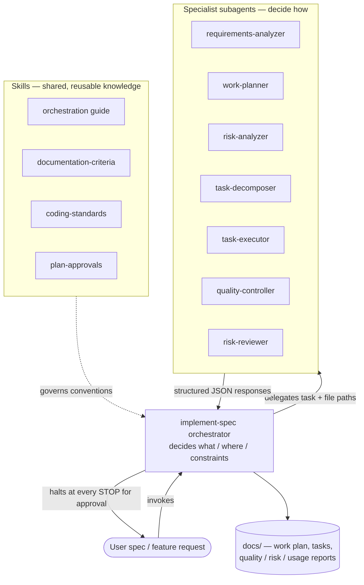
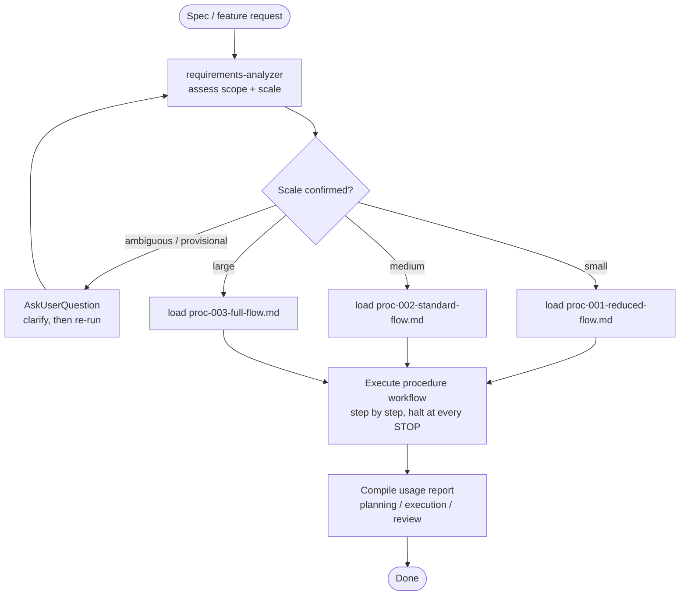
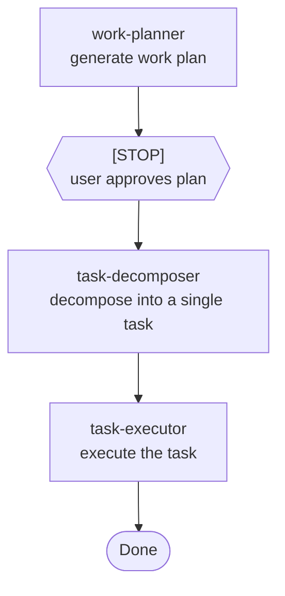

# agents

A reusable set of [Claude Code](https://claude.com/claude-code) **agent definitions, skills, and orchestration procedures** that turn a plain-language spec into implemented, quality-checked, risk-reviewed code through a coordinated team of specialist subagents.

## Table of Contents

1. [Overall Approach](#1-overall-approach)
   1. [Design principles](#11-design-principles)
2. [Installation](#2-installation)
   1. [Install as a plugin](#21-install-as-a-plugin)
   2. [Manual install into `.claude/`](#22-manual-install-into-claude)
3. [Commands](#3-commands)
4. [Quick Start](#4-quick-start)
5. [Repository / Folder Structure](#5-repository--folder-structure)
   1. [Folder structure produced by agents at runtime](#51-folder-structure-produced-by-agents-at-runtime)
6. [The Subagents](#6-the-subagents)
7. [How the Orchestrator Works](#7-how-the-orchestrator-works)
8. [Scale Flows](#8-scale-flows)
   1. [Small — Reduced Flow (PROC-001)](#81-small--reduced-flow-proc-001)
   2. [Medium — Standard Flow (PROC-002)](#82-medium--standard-flow-proc-002)
   3. [Large — Full Flow (PROC-003)](#83-large--full-flow-proc-003)
   4. [After any flow — Usage Report](#84-after-any-flow--usage-report)
9. [Usage](#9-usage)
10. [Makefile](#10-makefile)
11. [Pre-commit Hooks](#11-pre-commit-hooks)
12. [License](#12-license)

## 1. Overall Approach

Subagents combined with an orchestrator are used to create a strict separation between **orchestration** ("what to do and where") and **execution** ("how to do it").

- A single **orchestrator** (the `implement-spec` skill) drives the whole lifecycle. It never edits code itself — it only delegates, passes file paths between agents, tracks progress, and stops for user approval at defined checkpoints.
- A set of **specialist subagents** each own one responsibility (analyze, plan, decompose, execute, review). Each one decides *how* to accomplish its task autonomously from repo state and conventions, and returns a structured **JSON** response.
- **Skills** provide shared, reusable knowledge (orchestration rules, documentation locations, coding standards, approval protocol) so the same conventions apply no matter which agent is running.
- The amount of process applied is **proportional to the task's scale**. A one-line fix does not get a risk analysis; a new service does.

This produces a predictable, auditable pipeline: every run leaves behind a work plan, task files, quality/risk reports, and a usage report on disk under `docs/`.



### 1.1 Design principles

- **Orchestrator delegates, specialists execute.** The orchestrator passes *what/where/constraints*; specialists determine *how* (commands, flags, files to touch). See `subagents-orchestration-guide`.
- **Decision precedence when outputs conflict:** (1) user instructions → (2) task files & design artifacts → (3) objective repo state → (4) specialist judgment.
- **Structured hand-offs.** Subagents always respond in JSON against a schema, so the orchestrator can bridge outputs from one step into the inputs of the next without guessing.
- **Escalate, don't guess.** When a subagent can't determine how to proceed from repo state and artifacts, it reports as *blocked* rather than inventing an approach.
- **Canonical artifact locations.** The `documentation-criteria` skill is the single source of truth for where every artifact is written — no agent invents paths.

## 2. Installation

This repository is a self-contained [Claude Code plugin](https://code.claude.com/docs/en/plugins) named `subagents-dev` (see [`.claude-plugin/plugin.json`](.claude-plugin/plugin.json)). It bundles the specialist subagents under [`agents/`](agents/) and the skills under [`skills/`](skills/). There are two supported ways to install it.

### 2.1 Install as a plugin

Clone the repository and load it with the `--plugin-dir` flag, which points Claude Code at the directory containing `.claude-plugin/plugin.json`:

```bash
git clone https://github.com/PSauerborn/agents.git
claude --plugin-dir ./agents
```

Claude Code registers the `subagents-dev` plugin and its skills become available as **namespaced** slash commands — e.g. `/subagents-dev:implement-spec`. See [Commands](#3-commands) for the full list.

### 2.2 Manual install into `.claude/`

Alternatively, copy the `agents/` and `skills/` directories straight into a Claude Code configuration directory — either a single project's `.claude/`, or your global `~/.claude/` to make them available everywhere:

```bash
# project-local (available in that repo only)
cp -r agents skills /path/to/your-project/.claude/

# or global (available in every project)
cp -r agents skills ~/.claude/
```

Installed this way the skills are invoked **without** the plugin namespace — e.g. `/implement-spec`.

## 3. Commands

The plugin exposes three user-invocable slash commands. When installed as a plugin they are namespaced (`/subagents-dev:<name>`); when copied into `.claude/` they are invoked as `/<name>`.

| Command | Arguments | What it does |
| ------- | --------- | ------------ |
| `implement-spec` | `<spec or feature request>` | The orchestrator entry point. Determines the task's scale, runs the matching flow ([PROC-001/002/003](#8-scale-flows)), and stops for your approval at every `[STOP]` checkpoint. It never edits code itself — it delegates to the subagents. |
| `review-spec` | `<spec-path>` | Reviews a feature spec for clarity, conciseness, completeness, scope, and inconsistencies before you implement it. |
| `agent-doc-sync` | *(none)* | Analyzes the available subagents and regenerates their documented inputs/outputs in the `subagents-orchestration-guide` skill. |

The plugin also ships supporting **knowledge skills** — `coding-standards`, `documentation-criteria`, `plan-approvals`, and `subagents-orchestration-guide` — which Claude loads automatically while a command runs; you do not invoke these directly.

## 4. Quick Start

Kick off the pipeline from inside Claude Code by invoking the orchestrator skill with a spec:

```text
/implement-spec <your spec or feature request>
```

The orchestrator determines the task's scale, runs the matching flow, and **stops for your approval** at every `[STOP]` checkpoint before any code is changed. Every run leaves its work plan, task files, and quality/risk/usage reports under `docs/` — see [Usage](#9-usage) for the full lifecycle.

## 5. Repository / Folder Structure

Everything lives under `.claude/`, the standard Claude Code configuration directory:

```text
.claude/
├── agents/                         # Specialist subagent definitions (system prompts + tool grants)
│   ├── requirements-analyzer.md    #   Assess scope, affected files, and scale
│   ├── work-planner.md             #   Turn a spec into a structured work plan
│   ├── risk-analyzer.md            #   Produce a risk plan from a work plan
│   ├── task-decomposer.md          #   Split a work plan into single-commit task files
│   ├── task-executor.md            #   Implement the code for a task file
│   ├── quality-controller.md       #   Review changes vs. coding standards
│   ├── risk-reviewer.md            #   Review changes vs. the risk plan
│   └── security-reviewer.md        #   Security review of changes
│
└── skills/                         # Reusable knowledge & procedures
    ├── implement-spec/             # The top-level orchestrator
    │   ├── SKILL.md                #   Protocol, permitted tools, procedure
    │   └── reference/
    │       ├── proc-001-reduced-flow.md    # Small-scale procedure
    │       ├── proc-002-standard-flow.md   # Medium-scale procedure
    │       └── proc-003-full-flow.md       # Large-scale procedure
    ├── subagents-orchestration-guide/      # How to invoke subagents, inputs, precedence
    │   └── reference/responses/*.jsonc     #   Response JSON schema per subagent
    ├── documentation-criteria/     # Canonical output paths + templates
    │   └── reference/*.md          #   Work-plan / task / quality / risk / usage templates
    ├── coding-standards/           # Locate & apply applicable standards
    ├── plan-approvals/             # How to obtain user approval of plans
    ├── review-spec/                # Review a spec for clarity/completeness
    ├── implement-spec/ (above)
    └── agent-doc-sync/             # Keep agent docs in sync
```

### 5.1 Folder structure produced by agents at runtime

When the pipeline runs against a target repo, agents write all artifacts under `docs/`, following the layout defined by the `documentation-criteria` skill:

```text
docs/
├── plans/                                     # Work Plans
│   ├── {YYYY-MM-DD}-{workPlanId}.md           #   the work plan document
│   ├── tasks/{workPlanId}/                    #   decomposed, single-commit task files
│   │   ├── TASK-{number}.md
│   │   ├── TASK-RISK-REMEDIATION.md           #   only if risks require remediation
│   │   └── TASK-QC-REMEDIATION.md             #   only if quality violations are found
│   ├── quality/{workPlanId}/                  # Quality reports
│   │   └── {workPlanId}-quality-report.md
│   ├── risk/{workPlanId}/                     # Risk plans
│   │   └── {workPlanId}-risk-plan.md
│   └── usage/{workPlanId}/                    # Usage reports (tokens + time per phase)
│       └── {workPlanId}-usage-report.md
└── project-context/
    └── external-resources.md                  # external references for task-executor
```

Each work plan gets its own `workPlanId` namespace, so multiple plans coexist without collisions.

## 6. The Subagents

| Agent | Responsibility | Key output |
| ------- | ---------------- | ------------ |
| `requirements-analyzer` | Assess task type, affected files, and **scale** (small/medium/large) | Scale + affected-file JSON |
| `work-planner` | Convert a spec into a structured work plan with phases, tasks, dependencies | Work plan in `docs/plans/` |
| `risk-analyzer` | Analyze the work plan for risks, impacts, and mitigations | Risk plan |
| `task-decomposer` | Break the work plan into independent, single-commit task files | Task files in `docs/plans/tasks/` |
| `task-executor` | Implement the code changes described by a task file | Code changes |
| `quality-controller` | Review changes against coding standards; create remediation task if needed | Quality report (+ optional `TASK-QC-REMEDIATION.md`) |
| `risk-reviewer` | Review changes against the risk plan; create remediation task if needed | Risk review (+ optional `TASK-RISK-REMEDIATION.md`) |

All subagents respond in JSON conforming to the schemas in `subagents-orchestration-guide/reference/responses/`, and every response carries a `meta` block with token usage and execution time used to build the final usage report.

## 7. How the Orchestrator Works

The `implement-spec` skill is the single entry point. It is a pure **coordinator**: it drives the lifecycle using only `Agent`, `AskUserQuestion`, `TaskCreate`/`TaskUpdate`, read-only `Bash` (`git status`/`git diff`), and `Read`. All code edits are performed by subagents, and it never stages or commits — that is left to the user.

Given a spec, the orchestrator runs the same top-level loop regardless of task size:



1. **Determine scale.** Run `requirements-analyzer`, which returns a JSON `scale` of `small`, `medium`, or `large` (driven primarily by affected-file count). If the determination is ambiguous or `provisional`, the orchestrator clarifies with `AskUserQuestion` and re-runs until the scale is confirmed.
2. **Map scale → procedure.** Each scale maps to exactly one procedure file, and the orchestrator loads **only** that one to keep context minimal:

   | Scale  | Procedure file                        |
   |--------|---------------------------------------|
   | Small  | `reference/proc-001-reduced-flow.md`  |
   | Medium | `reference/proc-002-standard-flow.md` |
   | Large  | `reference/proc-003-full-flow.md`     |

3. **Execute the workflow.** Each procedure defines a workflow table of steps. The orchestrator runs them in order, invoking each subagent with explicit inputs and file paths, bridging one subagent's JSON output into the next step's inputs, and **halting at every `[STOP]`** to obtain user approval via `AskUserQuestion` before continuing.
4. **Compile the usage report.** After the workflow completes, it aggregates every subagent's `meta` usage (tokens + time) into **planning / execution / review** phases and writes the report to its canonical location.

The specific steps for each procedure are detailed in [Scale Flows](#8-scale-flows) below.

## 8. Scale Flows

The orchestrator first runs `requirements-analyzer`, which classifies the task by its most significant dimension (**file count is the primary criterion**), then loads the matching procedure. A larger classification wins if any single dimension qualifies.

| Scale | Files affected | Scope | Procedure |
| ------- | ---------------- | ------- | ----------- |
| **Small** | 1–2 files | Localized change (bug fix, copy/config tweak) | `proc-001-reduced-flow.md` |
| **Medium** | 3–5 files | Spans multiple components (new endpoint, module refactor) | `proc-002-standard-flow.md` |
| **Large** | 6+ files | Architecture-level (new service, data-model change, cross-cutting refactor) | `proc-003-full-flow.md` |

### 8.1 Small — Reduced Flow (PROC-001)

Minimal ceremony: plan → single task → execute.



### 8.2 Medium — Standard Flow (PROC-002)

Adds decomposition into multiple (parallelizable) tasks and a quality gate.

```mermaid
flowchart TD
    A[work-planner<br/>generate work plan] --> S{{"[STOP]<br/>user approves plan"}}
    S --> B[task-decomposer<br/>decompose into multiple task files]
    B --> C[task-executor<br/>execute task file&#40;s&#41; in parallel<br/>per Task Dependencies]
    C --> D[quality-controller<br/>review vs. coding standards]
    D --> E{QC remediation<br/>required?}
    E -->|yes| F[task-executor<br/>execute QC remediation task]
    E -->|no| G([Done])
    F --> G
```



### 8.3 Large — Full Flow (PROC-003)

Adds independent risk analysis up front and a risk-review gate at the end.

```mermaid
flowchart TD
    A[work-planner<br/>generate work plan] --> B[risk-analyzer<br/>produce risk plan]
    B --> S{{"[STOP]<br/>user approves work plan + risk plan"}}
    S --> C[task-decomposer<br/>decompose into multiple task files]
    C --> D[task-executor<br/>execute task file&#40;s&#41; in parallel<br/>per Task Dependencies]
    D --> E[quality-controller<br/>review vs. coding standards]
    E --> F{QC remediation<br/>required?}
    F -->|yes| G[task-executor<br/>execute QC remediation task]
    F -->|no| H[risk-reviewer<br/>review vs. risk plan]
    G --> H
    H --> I{Risk remediation<br/>required?}
    I -->|yes| J[task-executor<br/>execute risk remediation task]
    I -->|no| K([Done])
    J --> K
```



### 8.4 After any flow — Usage Report

Once the workflow completes, the orchestrator collects the `meta` block that every subagent returns — its execution time and token count — and aggregates the data into a usage report written to the canonical `docs/plans/usage/{workPlanId}/` location. Every run is attributed to one of three phases: **planning**, **execution**, or **review**.

The report (rendered from the `usage-report-template` in `documentation-criteria`) captures:

- **Agents Used** — one row per *agent invocation* (`Agent`, `Phase`, `Run`, `Duration`, `Tokens`), plus a grand total. Because an agent can run several times — the `task-executor`, for example, typically runs once per task — each run is numbered in the `Run` column and listed on its own row.
- **Token Usage → By Agent** — the same data collapsed to one row per agent (`Runs`, `Total Duration`, `Total Tokens`), surfacing which specialist consumed the most time and tokens.
- **Token Usage → By Phase** — totals grouped by `planning` / `execution` / `review`, showing where effort was spent across the lifecycle.

Together these give an auditable, per-run **and** per-phase breakdown of how long the pipeline took and how many tokens it spent.

## 9. Usage

These definitions are meant to be placed in a project's `.claude/` directory (or shared globally). Kick off the pipeline by invoking the orchestrator skill with a spec:

```text
/implement-spec <your spec or feature request>
```

The orchestrator will determine scale, run the appropriate flow, and **stop for your approval** at every `[STOP]` checkpoint before making changes. All planning, task, quality, risk, and usage artifacts are written under `docs/` for review.

> **Note:** The orchestrator never stages or commits changes — it may run `git status` / `git diff` to verify state, but committing is left to you.

## 10. Makefile

Common developer tasks are exposed through the [`Makefile`](Makefile). Run a target with `make <target>`:

| Target | Description |
| ------ | ----------- |
| `scan-secrets` | Scan the repository with [`detect-secrets`](https://github.com/Yelp/detect-secrets), write the results to `.secrets.baseline`, then open the interactive audit of that baseline. |

```bash
make scan-secrets
```

The generated `.secrets.baseline` is the same baseline consumed by the `detect-secrets` pre-commit hook (see [Pre-commit Hooks](#11-pre-commit-hooks)), so regenerating it keeps local scans and the commit-time gate in sync.

## 11. Pre-commit Hooks

The repository uses [`pre-commit`](https://pre-commit.com) to enforce file hygiene, Markdown linting, and secret scanning before every commit. The hooks are defined in [`.pre-commit-config.yaml`](.pre-commit-config.yaml).

### Setup

```bash
pip install pre-commit      # once, if not already installed
pre-commit install          # install the git hook into .git/hooks
```

### Running manually

```bash
pre-commit run --all-files  # run every hook against all files
pre-commit run markdownlint # run a single hook by id
```

### Configured hooks

| Hook | Purpose |
| ---- | ------- |
| `end-of-file-fixer` | Ensure files end with a single newline |
| `trailing-whitespace` | Strip trailing whitespace (preserves Markdown hard line breaks) |
| `mixed-line-ending` | Normalize line endings to LF |
| `check-added-large-files` | Block files larger than 1 MB |
| `check-merge-conflict` | Block unresolved merge-conflict markers |
| `check-case-conflict` | Catch names that clash on case-insensitive filesystems |
| `check-yaml` | Validate YAML syntax (agent/skill frontmatter, config) |
| `check-json` | Validate JSON syntax |
| `markdownlint` | Lint Markdown against the rules in [`.markdownlint.yaml`](.markdownlint.yaml) |
| `detect-secrets` | Scan for committed secrets against `.secrets.baseline` |

Markdown rules live in [`.markdownlint.yaml`](.markdownlint.yaml): long lines (`MD013`), inline HTML (`MD033`), and a non-H1 first line (`MD041`) are allowed, and repeated headings are permitted under different parents (`MD024` `siblings_only`) to support the per-phase document templates.

## 12. License

See [LICENSE](LICENSE).
