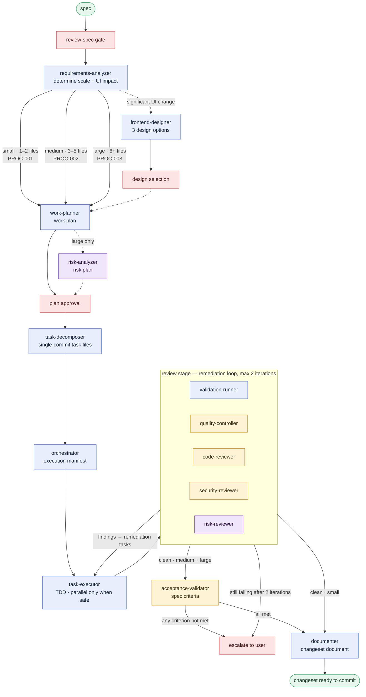

# agents

A reusable set of [Claude Code](https://claude.com/claude-code) agent definitions, skills, and orchestration procedures that turn a plain-language spec into a validated, reviewed, documented changeset through a coordinated team of specialist subagents.

A single orchestrator (the `implement-spec` skill) drives the lifecycle: it delegates all work to specialist subagents, passes artifact paths between them, and stops for your approval at defined checkpoints. It never edits code and never commits — subagents implement, and committing is left to you. Each subagent owns one responsibility, carries only the context its role requires, and returns a structured JSON response (`completed` or `blocked` with a typed reason). Shared skills define the conventions — orchestration rules, canonical artifact locations, coding standards, the approval protocol — so every run is repeatable, and the amount of process is proportional to the task's scale: a one-line fix does not get a risk analysis; a new service does.

## Quickstart

Install as a plugin:

```bash
git clone https://github.com/PSauerborn/agents.git
claude --plugin-dir ./agents
```

Or copy the definitions into a project's `.claude/` (or `~/.claude/` for global use):

```bash
cp -r agents skills /path/to/your-project/.claude/
```

Then kick off the pipeline with a spec:

```text
/implement-spec <your spec or feature request>
```

(Namespaced as `/subagents-dev:implement-spec` when installed as a plugin.) You can also pre-review a spec with `/review-spec <spec-path>`.

The orchestrator reviews the spec, determines scale, runs the matching flow, and stops for approval at every `[STOP]` checkpoint. All artifacts — work plan, task files, execution manifest, review reports, changeset — are written under `docs/` in the target repo for review.

## The Flow

Every run follows the same lifecycle; scale determines how much of it applies:


```mermaid
flowchart TD
    SPEC([spec]) --> GATE["review-spec gate"]
    GATE --> REQ["requirements-analyzer<br/>determine scale + UI impact"]

    REQ -->|"small · 1–2 files<br/>PROC-001"| PLAN
    REQ -->|"medium · 3–5 files<br/>PROC-002"| PLAN
    REQ -->|"large · 6+ files<br/>PROC-003"| PLAN

    REQ -.->|"significant UI change"| DESIGN["frontend-designer<br/>3 design options"]
    DESIGN --> SELECT["design selection"]
    SELECT -.-> PLAN

    PLAN["work-planner<br/>work plan"] -->|"large only"| RISK["risk-analyzer<br/>risk plan"]
    PLAN --> APPROVE["plan approval"]
    RISK --> APPROVE

    APPROVE --> DECOMP["task-decomposer<br/>single-commit task files"]
    DECOMP --> MANIFEST["orchestrator<br/>execution manifest"]
    MANIFEST --> EXEC["task-executor<br/>TDD · parallel only when safe"]
    EXEC --> REVIEW

    subgraph REVIEW["review stage — remediation loop, max 2 iterations"]
        direction LR
        VAL["validation-runner"]
        QC["quality-controller"]
        CR["code-reviewer"]
        SEC["security-reviewer"]
        RR["risk-reviewer"]
    end

    REVIEW -->|"findings → remediation tasks"| EXEC
    REVIEW -->|"still failing after 2 iterations"| ESCALATE["escalate to user"]
    REVIEW -->|"clean · small"| DOC
    REVIEW -->|"clean · medium + large"| ACCEPT["acceptance-validator<br/>spec criteria"]
    ACCEPT -->|"any criterion not met"| ESCALATE
    ACCEPT -->|"all met"| DOC["documenter<br/>changeset document"]
    DOC --> DONE([changeset ready to commit])

    classDef all fill:#e8eefc,stroke:#3b5bdb,color:#10203f
    classDef med fill:#fff3d6,stroke:#c98a00,color:#3f2d10
    classDef large fill:#f0e6fb,stroke:#7c3aed,color:#2c1046
    classDef stop fill:#fde4e4,stroke:#d64545,color:#4a1010
    classDef terminal fill:#e6f6ec,stroke:#2f9e5e,color:#0f3a22

    class REQ,PLAN,DECOMP,MANIFEST,EXEC,VAL,DOC,DESIGN all
    class QC,CR,SEC,ACCEPT med
    class RISK,RR large
    class GATE,APPROVE,SELECT,ESCALATE stop
    class SPEC,DONE terminal

    linkStyle 8 stroke-dasharray: 5 5
    linkStyle 10 stroke-dasharray: 5 5
```

Blue = every flow · amber = medium and large only · purple = large only · red = `[STOP]` checkpoints where the orchestrator waits for you · dashed = conditional.

| Scale | Files affected | Flow | Review stages |
| ----- | -------------- | ---- | ------------- |
| **Small** | 1–2 | `proc-001-reduced-flow` | validation only |
| **Medium** | 3–5 | `proc-002-standard-flow` | validation, standards, correctness, security, acceptance |
| **Large** | 6+ (architectural) | `proc-003-full-flow` | all of the above plus risk planning and risk review |

Key mechanics:

- **Execution manifest** — the orchestrator maintains a single manifest of everything the executors changed; all reviewers and the documenter work from it rather than re-deriving the changeset.
- **Review & remediation loop** — reviewers produce remediation task files; executors apply them; the flagging reviewer re-verifies. After 2 iterations with outstanding findings, the run stops and escalates to you.
- **Frontend design gate** — when the requirements analysis reports a significant UI change, the `frontend-designer` produces three distinct design options (design doc + static HTML mockup each); the run stops until you select one, and the chosen design feeds the work plan.
- **Parallel execution guard** — tasks run in parallel only when they have no dependency relationship and disjoint write sets.
- **Blocked, not improvised** — any agent missing a required input returns `blocked` with a typed reason; the orchestrator routes the fix or escalates instead of letting agents guess.

## Available Agents

| Agent | Responsibility |
| ----- | -------------- |
| `requirements-analyzer` | Assess task type, affected files, scale (small/medium/large), and UI impact |
| `frontend-designer` | Produce 3 distinct design options (doc + HTML mockup) for significant UI changes; user selects one |
| `work-planner` | Convert a spec + requirements summary (and selected design, if any) into a structured work plan |
| `risk-analyzer` | Produce a risk plan (risks, impacts, mitigations) from the work plan |
| `task-decomposer` | Split the work plan into independent, single-commit task files |
| `task-executor` | Implement exactly one task file (TDD: red-green-refactor) |
| `validation-runner` | Discover and run the project's full build/test/lint suite |
| `quality-controller` | Review the changeset for coding-standards conformance |
| `code-reviewer` | Peer-review the changeset for correctness, edge cases, and design |
| `security-reviewer` | Review the changeset for security defects |
| `risk-reviewer` | Verify the changeset implements the risk plan's mitigations |
| `acceptance-validator` | Verify every spec acceptance criterion is demonstrably met |
| `documenter` | Update doc strings, API schemas, and READMEs; produce the changeset document |

Response schemas live in `skills/subagents-orchestration-guide/reference/responses/`; artifact templates and canonical output paths in `skills/documentation-criteria/`.

## Development

`make scan-secrets` runs a [detect-secrets](https://github.com/Yelp/detect-secrets) scan; [pre-commit](https://pre-commit.com) hooks (`pre-commit install`) enforce file hygiene, Markdown linting, and secret scanning.

## License

See [LICENSE](LICENSE).
