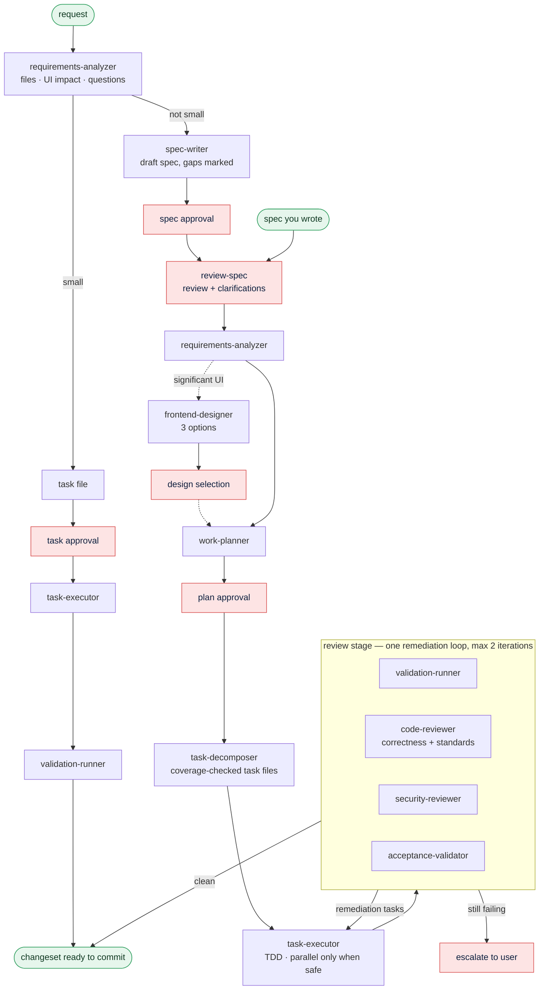

# agents

A reusable set of [Claude Code](https://claude.com/claude-code) agent definitions, skills, and orchestration procedures that turn a spec or a plain-language request into a validated, reviewed changeset through a coordinated team of specialist subagents.

Two entry points share the same agents:

- **`/implement-request <request>`** — start from your own words. A small change (one or two files) runs as a single task file with full-suite validation. Anything larger gets a drafted spec for you to approve, then runs the full workflow. This is the spec-kit style path: you never have to write the spec yourself.
- **`/implement-spec <spec-path>`** — start from a spec you wrote with `/init-spec`. Review and clarify, analyse, optionally design, plan, decompose, execute, review, validate acceptance.

Orchestrators never edit code and never commit — subagents implement, and committing is left to you. Each subagent owns one responsibility, carries only the context its role requires, and returns a structured JSON response (`completed` or `blocked` with a typed reason). Shared skills define the conventions — orchestration rules, canonical artifact locations, coding standards, the approval protocol — so every run is repeatable.

## Quickstart

Install as a plugin:

```bash
git clone https://github.com/PSauerborn/agents.git
claude --plugin-dir ./agents
```

Or copy the definitions into a project's `.claude/` (or `~/.claude/` for global use):

```bash
cp -r agents skills /path/to/your-project/.claude/
```

Set `CODING_STANDARDS_DIR` to your standards repository — the `coding-standards` skill requires it. Then:

```text
/implement-request fix the off-by-one in paginate()      # small: one task, no spec
/implement-request add CSV export to the orders page     # larger: drafts a spec, you approve, full flow
/init-spec <feature description>                         # or scaffold a spec yourself ...
/implement-spec docs/specs/SPEC-NNN.md                   # ... and run it
```

(Namespaced as `/subagents-dev:<skill>` when installed as a plugin.) `/review-spec <spec-path>` runs the review and clarification gate on its own.

## The Flow


```mermaid
flowchart TD
    REQUEST([request]) --> ANALYZE["requirements-analyzer<br/>files · UI impact · questions"]
    ANALYZE -->|"small"| QTASK["task file"] --> QAPPROVE["task approval"] --> QEXEC["task-executor"] --> QVAL["validation-runner"] --> DONE
    ANALYZE -->|"not small"| WRITE["spec-writer<br/>draft spec, gaps marked"] --> SAPPROVE["spec approval"] --> GATE

    SPEC([spec you wrote]) --> GATE["review-spec<br/>review + clarifications"]
    GATE --> REQ["requirements-analyzer"]
    REQ -.->|"significant UI"| DESIGN["frontend-designer<br/>3 options"] --> SELECT["design selection"] -.-> PLAN
    REQ --> PLAN["work-planner"]
    PLAN --> APPROVE["plan approval"]
    APPROVE --> DECOMP["task-decomposer<br/>coverage-checked task files"]
    DECOMP --> EXEC["task-executor<br/>TDD · parallel only when safe"]
    EXEC --> REVIEW

    subgraph REVIEW["review stage — one remediation loop, max 2 iterations"]
        direction LR
        VAL["validation-runner"]
        CR["code-reviewer<br/>correctness + standards"]
        SEC["security-reviewer"]
        ACC["acceptance-validator"]
    end

    REVIEW -->|"remediation tasks"| EXEC
    REVIEW -->|"still failing"| ESCALATE["escalate to user"]
    REVIEW -->|"clean"| DONE([changeset ready to commit])

    classDef stop fill:#fde4e4,stroke:#d64545,color:#10203f
    classDef terminal fill:#e6f6ec,stroke:#2f9e5e,color:#0f3a22
    class GATE,APPROVE,SELECT,ESCALATE,QAPPROVE,SAPPROVE stop
    class SPEC,DONE,REQUEST terminal
```

Red = `[STOP]` checkpoints where the orchestrator waits for you · dashed = conditional.

There is one flow, not three. The only routing decision is whether a request is **small** (a localized change to at most two files): small requests skip the spec, plan, and review stages; everything else runs every stage, whether the spec was written by you or drafted from your request.

Key mechanics:

- **Specify, don't guess** — a drafted spec marks every unknown as `[NEEDS CLARIFICATION]` instead of inventing a requirement, and you approve the draft before anything is planned.
- **Clarify, don't guess** — the spec review asks the marked questions first, then a bounded set of further one-at-a-time questions (five per feature), and records your answers in the review document; the spec itself is never edited by an agent once approved.
- **Execution manifest** — the orchestrator maintains one manifest of everything the executors changed; every reviewer works from it.
- **One remediation loop** — every reviewer returns the same `findings / remediationRequired / remediationTaskPath` shape; executors apply remediation tasks; the flagging reviewer re-verifies. After 2 iterations with outstanding findings the run stops and escalates.
- **Coverage before execution** — the decomposer blocks if any acceptance criterion has no task or any task has no criterion.
- **Parallel execution guard** — tasks run in parallel only when they have no dependency relationship and disjoint write sets.
- **Blocked, not improvised** — any agent missing a required input returns `blocked` with a typed reason.

## Artifacts

Everything lives under `docs/` in the target repo:

```text
docs/specs/SPEC-NNN.md, SPEC-NNN-REVIEW.md
docs/designs/DES-NNN/
docs/plans/WP-NNN/work-plan.md, manifest.md, tasks/
docs/plans/quick/YYYY-MM-DD-slug/manifest.md, tasks/
```

## Agents

| Agent | Responsibility |
| --- | --- |
| `requirements-analyzer` | Assess task type, whether the change is small, UI impact, write set, read set, and open questions |
| `spec-writer` | Draft a spec from a plain-language request, marking every unknown for clarification |
| `frontend-designer` | Produce 3 distinct design options (doc + HTML mockup) for significant UI changes |
| `work-planner` | Convert a spec, its review, and the requirements summary into a work plan |
| `task-decomposer` | Split the work plan into single-commit task files; verify criterion coverage |
| `task-executor` | Implement exactly one task file (TDD) |
| `validation-runner` | Run the project's full build/test/lint suite; verdict `verified / partial / failed` |
| `code-reviewer` | Peer-review the changeset for correctness, edge cases, design, and standards |
| `security-reviewer` | Review the changeset for any exploitable weakness and dependency risk |
| `acceptance-validator` | Verify every spec acceptance criterion is demonstrably met |

Response schemas live in `skills/subagents-orchestration-guide/reference/responses/`; artifact templates and canonical paths in `skills/documentation-criteria/`.

## Development

`make scan-secrets` runs a [detect-secrets](https://github.com/Yelp/detect-secrets) scan; [pre-commit](https://pre-commit.com) hooks (`pre-commit install`) enforce file hygiene, Markdown linting, and secret scanning.

## License

See [LICENSE](LICENSE).
